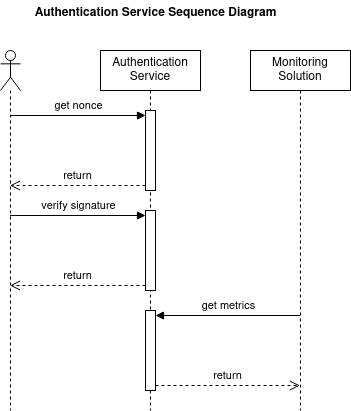

# Authentication Service Architecture Document

### Overview

The Authentication Service is a micro service designed to authenticate end users using their crypto account via a self custodial wallet. This application follows an event-driven architecture emphasizing speed, scalability and adaptability. The service exposes three endpoints in total, two of which facilitates the authentication process while the third end point is for metrics collection. Additionally, it features a front-end component for a user-friendly experience.

<figure><figcaption></figcaption></figure>

### Contents

* [endpoints.md](authentication-service-architecture-document/endpoints.md "mention")
* [authentication-flow.md](authentication-service-architecture-document/authentication-flow.md "mention")
* [service-level-objectives-slos.md](authentication-service-architecture-document/service-level-objectives-slos.md "mention")
* [technology-stack.md](authentication-service-architecture-document/technology-stack.md "mention")
* [deployment-considerations.md](authentication-service-architecture-document/deployment-considerations.md "mention")
* [functional-requirement-diagram.md](authentication-service-architecture-document/functional-requirement-diagram.md "mention")
