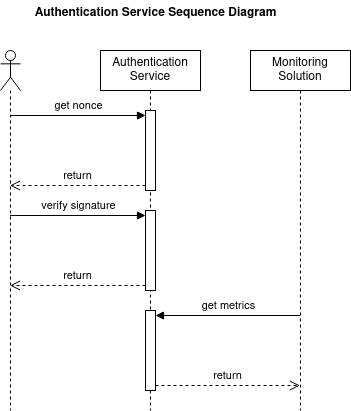

# 🈁 Data Flow Diagram

<figure><figcaption></figcaption></figure>

1. The user initiates the authentication process by accessing the authentication page.
2. MetaMask prompts the user to share their public address.
3. In the background, the address is utilized in the `/v1/account/:address/nonce` endpoint to generate and store a nonce in the database. Simultaneously, a nonce is returned to the page for future use. The nonce plays a part in preventing replay & man in the middle attacks.
4. The page uses MetaMask to prompt the user to sign a static message concatenated with the dynamic nonce.
5. The signed message is then posted to the `/v1/account/:address/verifySignature` endpoint for verification.
6. The service derives the public key from the signature, extracts the address, and compares it with the one in the URL.
7. If the addresses match, the user is authenticated, and a JWT secret is issued for authorization
