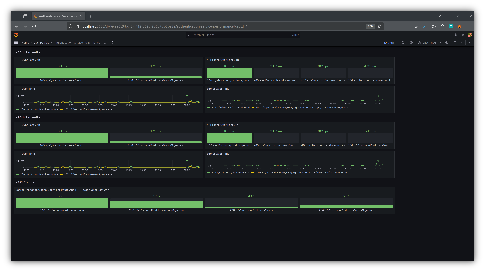

# 🔁 Response Times

Our Service Level Objective (SLO) for responsiveness targets a response time below the 2-second threshold for the 90th percentile of cases. To enhance our understanding of system performance, we distinguish between network latency and API response times, measuring both round-trip time and API response time.

In the accompanying image, the first row displays metrics for the 80th percentile of round-trip time and API response time over the past 24 hours. The second row provides similar metrics for the 90th percentile. Within these rows, the second sub-row features line charts labeled 'RTT Over Time' and 'Server Over Time,' allowing for dynamic adjustment to view historical data across different time frames.

Additionally, to identify potential issues, we include counts of HTTP response codes for various paths.

<figure><figcaption></figcaption></figure>

