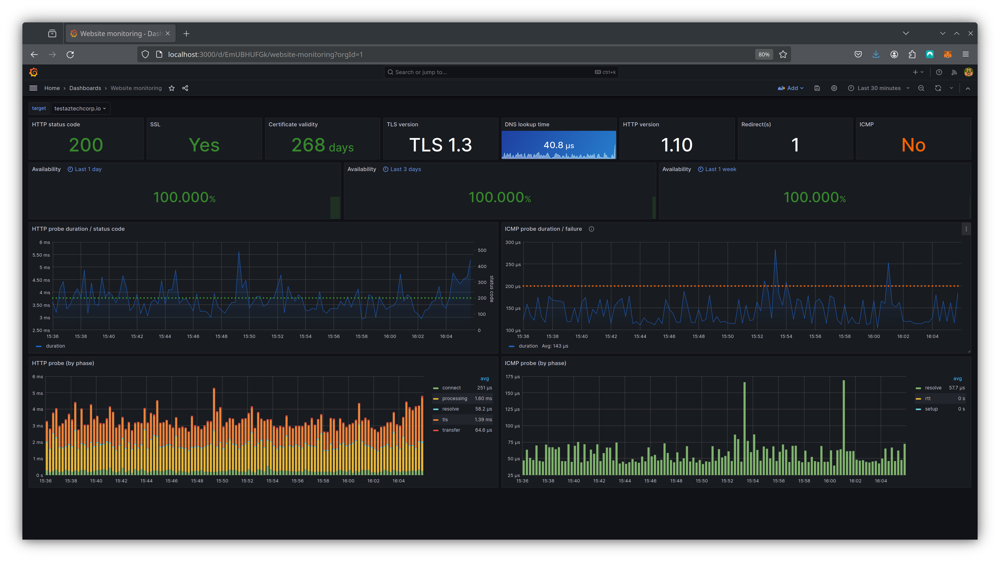

# ⬆️ Uptime

Our Service Level Objective (SLO) for uptime is 99.9%, or three nines uptime. To oversee this metric, we leverage Prometheus and Blackbox Exporter, supported by a web dashboard in Grafana. In the accompanying image, pay attention to the second row titled 'Availability,' which shows our uptime statistics. Additionally, it provides valuable data regarding our TLS certificate status and the duration of HTTP and ICMP probes.

<figure><figcaption></figcaption></figure>
