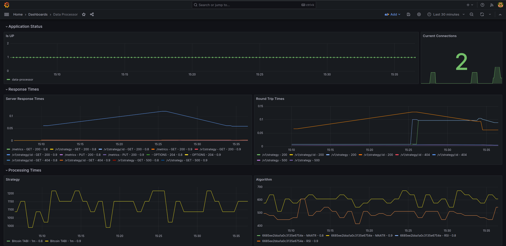

# 🖥️ Monitoring

Two of the three SLI's can be monitored with the Grafana dashboard below. The dashboard is designed to show the health of the service.From top row to bottom row we have:

1. **Availability** - 1 indicates service is UP, **current active HTTP connections**
2. **Response times** over time for the API calls as well as the round trip times for the 80th and 90th percentile.
   1. If these become large the dataset will have to be trimmed to improve performance.
3. **Processing Times** we record both the processing times for strategies as a whole as well as each algorithm of a strategy.
4. **Fault tolerance** we get for free from the message broker

<figure><figcaption></figcaption></figure>
