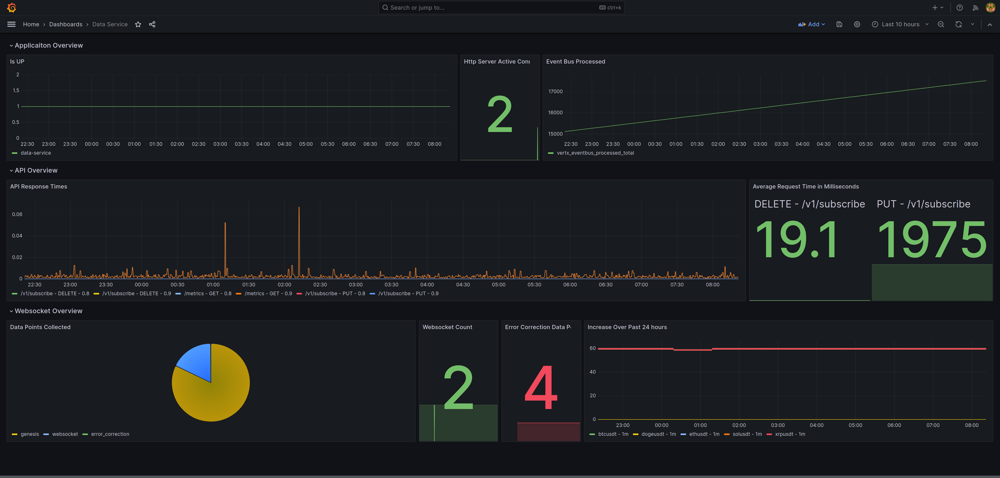

# ⏩ Data Consistency, Availability, Fault Tolerance

All three of our SLI's can be monitored with the Grafana dashboard below. The dashboard is designed to show the health of the service.

From top row to bottom row we have:

1. **Availability** - 1 indicates service is UP, **current active HTTP connections**, **event bus processing** - a non linear line here will indicate a problem.
2. **API response** times over time and **average response** times for API calls.
3. **Data consistency**: the pie chart will give us a breakdown of the origins of our data collection, the origin can be
   1. **Data point origin**.
      1. **Genesis** - on a new subscriptions the data history is retrieved, this history time span is equal to the environment variable BINANCE\_GENESIS\_KLINES\_IN\_DAYS.
      2. **Web socket** - data that comes in over time via the web socket feed.
      3. **Error correction** - In the case where a data point didn't come in via the web socket stream, it will be manually retrieved and inserted.
      4. **Application Restart** - after an application restart we check for missing data points to ensure all missing data is gathered.
   2. **Web socket count**
   3. **Data points** collected by means of **error correction**, a rapid increase here will indicate an underlying problem.
   4. **Data points** increase over time through **web sockets** - this line should be flat, in our case we can see a slight dip which coincides with the 4 data points that was collected via **error correction**.

<figure><figcaption></figcaption></figure>
