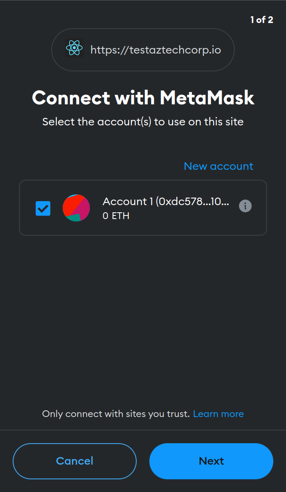

# 🦊 Connect MetaMask To The Authenticaton Service

If MetaMask hasn't been connected to the Authentication Service before, a dialog will prompt you to initiate the connection process. This occurs only during the initial authentication using MetaMask. Simply select the account you wish to connect, and click 'connect'. In the example below, there is only one account available for selection.

<figure><figcaption></figcaption></figure>
