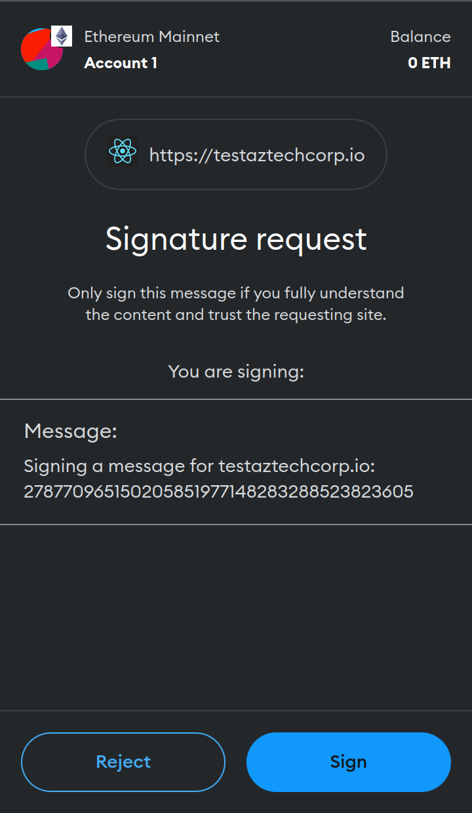

# 🖊️ Signature Request

After connecting MetaMask, you'll be prompted to sign a message. If you've connected MetaMask previously, this will be the first dialog upon clicking the 'Connect wallet' button on the homepage. The message to sign includes a static text: 'Signing a message for aztechcorp.io,' along with a changing nonce, such as '278\*\*\*\*\*605,' which updates with each request to the Authentication Service.

<figure><figcaption></figcaption></figure>
