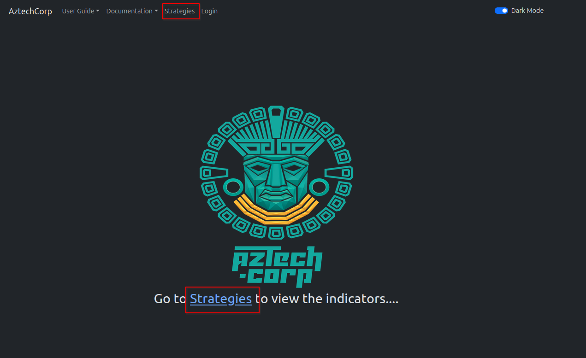
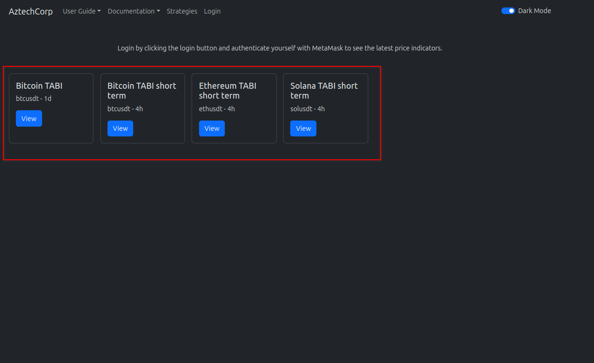
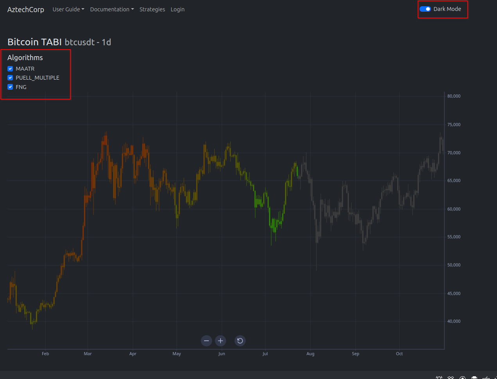
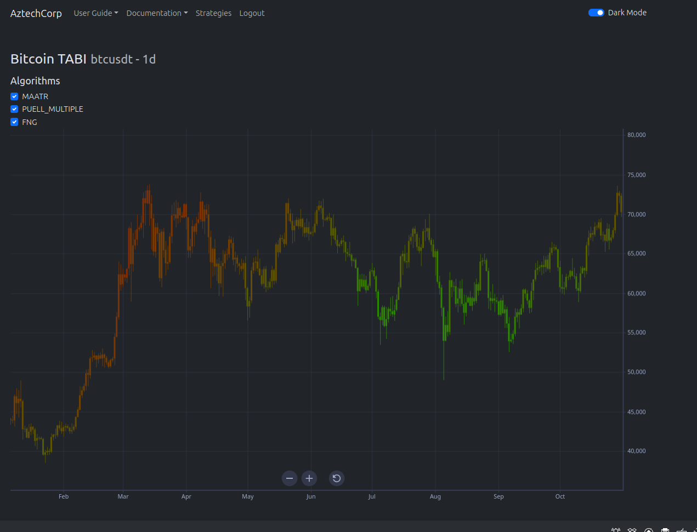
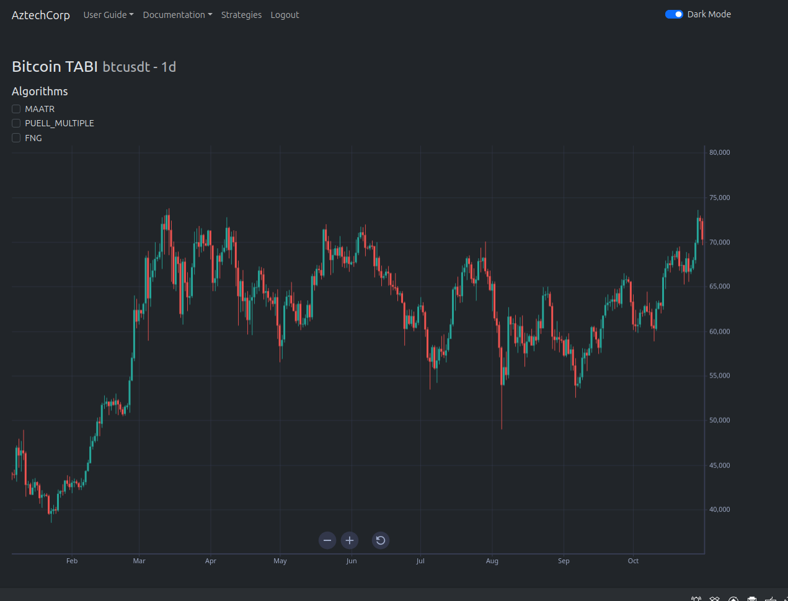

# 📈 Using The Application

At the home page you can view the strategies either by clicking on the strategies link in the header or on the link in body of the home page.

<figure><figcaption></figcaption></figure>

You will then navigate to the strategy list page where you can pick the strategy you would like to view by clicking on the strategies view button.

<figure><figcaption></figcaption></figure>

By default, all algorithms of a strategy are activated. The chart uses shades of red when the market price is approaching a potential top, with bright red indicating a strong sell zone. It uses shades of green when the market price is nearing a bottom, with bright green indicating a strong buy zone. When you uncheck an algorithm, the chart adjusts to exclude its data. Dark mode enhances the chart's colors, making it advantageous to switch to this mode for better visibility. If you have not authenticated using MetaMask, the latest price points will default to gray.

<figure><figcaption></figcaption></figure>

If you have authenticated using MetaMask, the latest price points will be colored according to the indicator.

<figure><figcaption></figcaption></figure>

When no algorithms are selected the chart will display with native colors.

<figure><figcaption></figcaption></figure>

