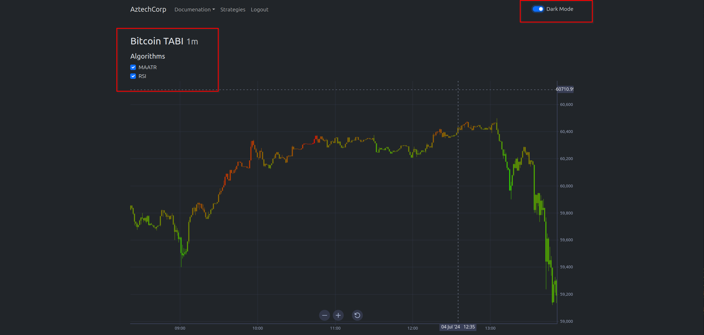
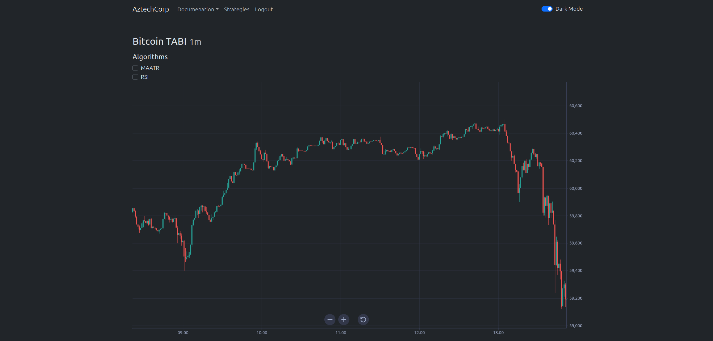

# 📈 Using The Indicator

By default, all algorithms are activated. The chart uses shades of red when the market price is approaching a potential top, with bright red indicating a strong sell zone. It uses shades of green when the market price is nearing a bottom, with bright green indicating a strong buy zone. When you uncheck an algorithm, the chart adjusts to exclude its data. Dark mode enhances the chart's colors, making it advantageous to switch to this mode for better visibility.

<figure><figcaption></figcaption></figure>

When no algorithms are selected the chart will display with native colors.

<figure><figcaption></figcaption></figure>
